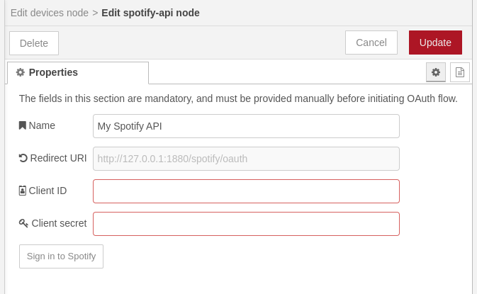

# node-red-spotify

This is a collection of Node-RED nodes intended to control Spotify instances running on your devices. For the time being, only the "play/pause" feature is available, but more interactions should appear soon.

## Getting started

### Setup configuration node

Before you can start controlling your devices, you have to have at least one configuration node which represents a single Spotify account linked with your developer app. You can have as many configuration nodes as needed, but usually one is enough (unless your intention is to control multiple Spotify accounts).

A configuration node requires a pair of application credentials known as: *client ID*, and *secret key*. Those credentials can be obtained from the [Spotify Developer portal](https://developer.spotify.com) where you can create your own application free of charge. One application can be used to link and control multiple Spotify accounts. The detailed instruction how to create an app, can be found in the [getting started guide](https://developer.spotify.com/documentation/web-api/tutorials/getting-started) on the same page.

> [!IMPORTANT]
> When creating the app, you will be asked to provide redirect URIs. It is important to give the same redirect URI which is displayed in the configuration form of the configuration node. The URI can be different from what's shown below, it depends on how and where you've deployed Node-RED.
> 

When the app is ready, in its properties you will be able to peek the *client ID* and *secret key*. Now you have to put those into the configuration form, click **Update**, and deploy your flows.

It's critical to deploy your changes before going further. When the partially set up configuration is used by a node, it will report "not authenticated" status after deployment.


### Link the account

In order to link actual Spotify account with the configuration node, edit the same configuration node you've created in the previous step, and you should observe that **Sign in to Spotify** button is now enabled. When you click on it, you will be redirected to another page where you can link your Spotify account with the app which you've created earlier. After successful linking, you should be redirected to a page telling you that everything went well, and the page should close itself automatically.

Now, you can update the configuration node again, deploy the changes, and you can start using the newly created configuration in *spotify* nodes. All "not authenticated" statuses should disappear once the configuration is complete.

## Nodes

### devices

Get all available devices when triggered by arbitrary message.

#### Outputs

| msg.    | Type   | Description            |
|---------|--------|------------------------|
| topic   | string | The ID of a device.    |
| payload | object | Details of the device. |

#### Details

Upon arrival of any message (can come from the simplest *inject* node) the node sends as many messages, as there are devices available. The *`msg.topic`* will contain the unique ID of the device, and the `msg.payload` will contain details of that device as described in Spotify Web API Reference.

This node can be a direct input of other *spotify* nodes. If only a subset of devices should be considered, the unwanted devices (messages) can be easily filtered out by using the *switch* node.

#### Example output

**topic**

```
1112223334445556667778888999000aaabbbccc
```

**payload**

```json
{
  "id": "1112223334445556667778888999000aaabbbccc",
  "is_active": true,
  "is_private_session": false,
  "is_restricted": false,
  "name": "Web Player (Chrome)",
  "supports_volume": true,
  "type": "Computer",
  "volume_percent": 100
}
```

### play/pause

Play or pause playback on a device.

#### Inputs

| msg.    | Type    | Description                                        |
|---------|---------|----------------------------------------------------|
| topic   | string  | The ID of a device to control.                     |
| payload | boolean | `true` to resume playback, or `false` to pause it. |

#### Details

`msg.topic` is used to select the target device, and must be a unique identifier as returned from the *devices* node. The *devices* node can be used as a direct input, in such case all devices returned by that node will be resumed or paused depending on the value of `msg.payload`.

#### Example input

**topic**

```
1112223334445556667778888999000aaabbbccc
```

**payload**

```json
true
```
